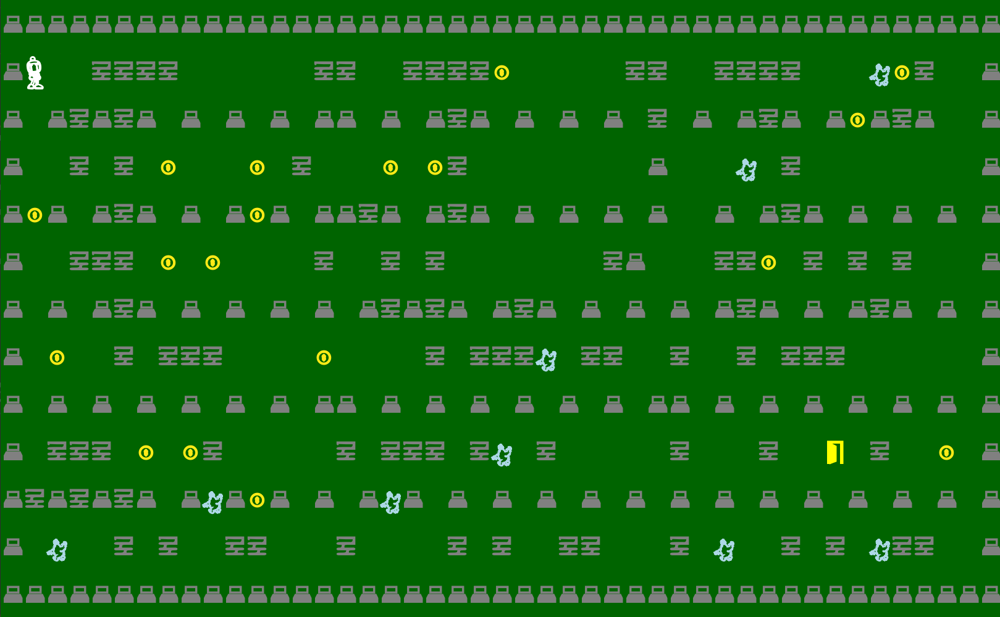
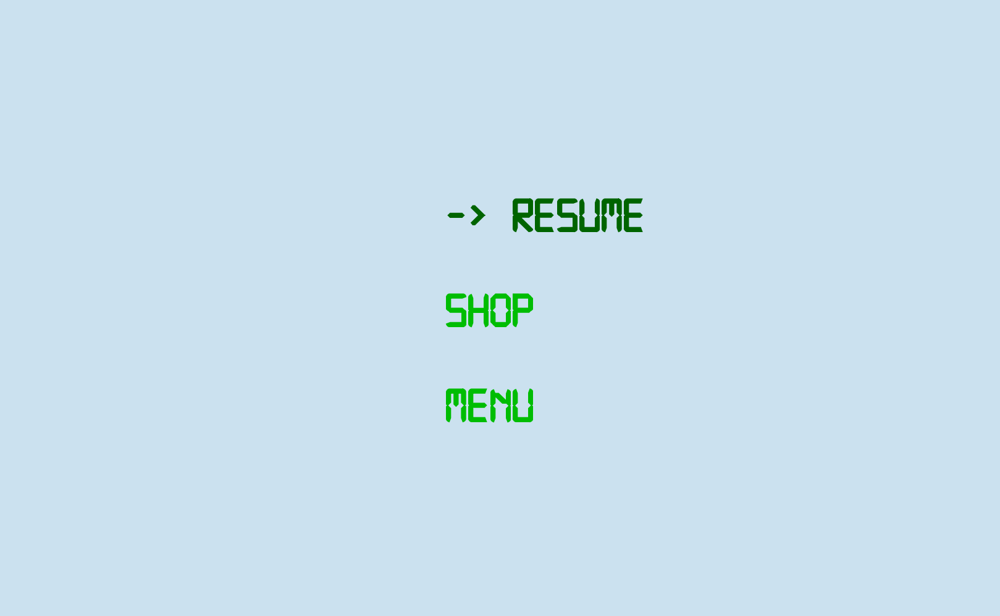
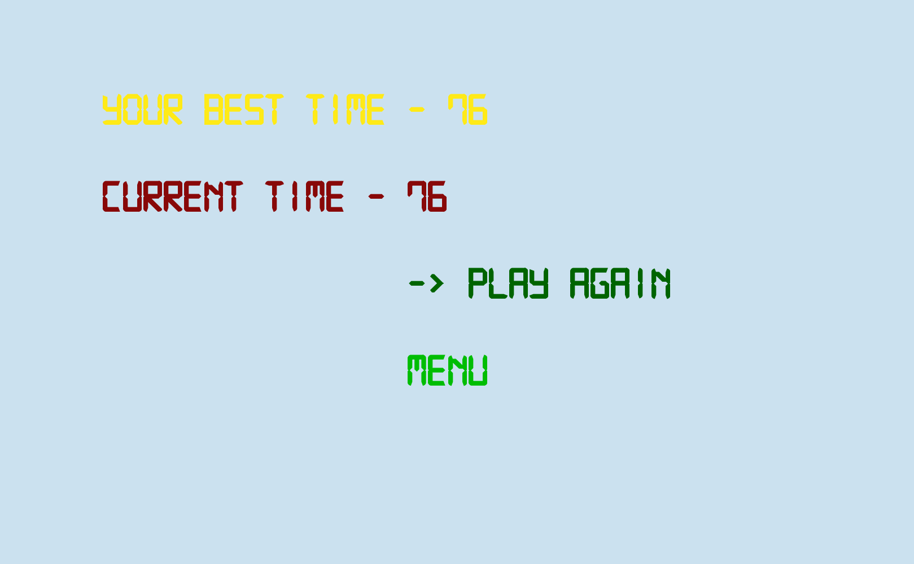
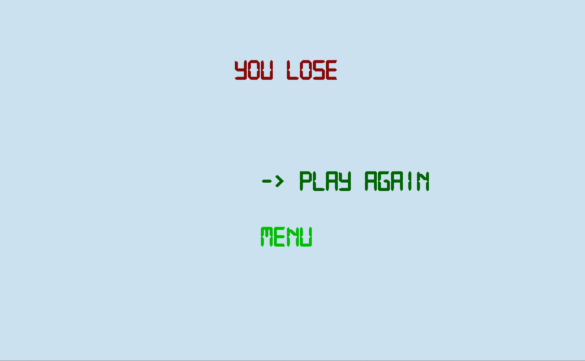
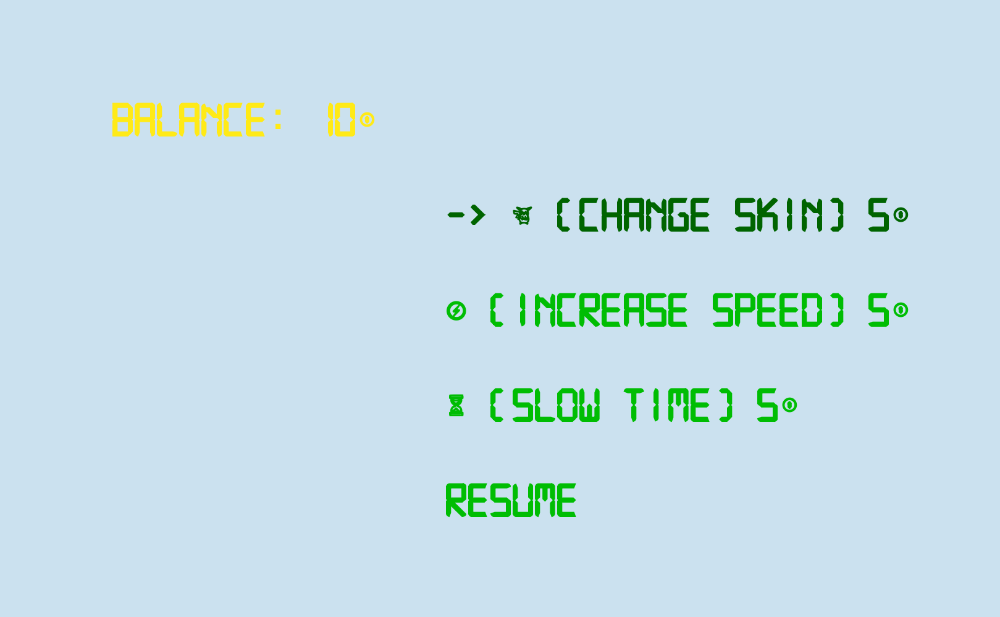
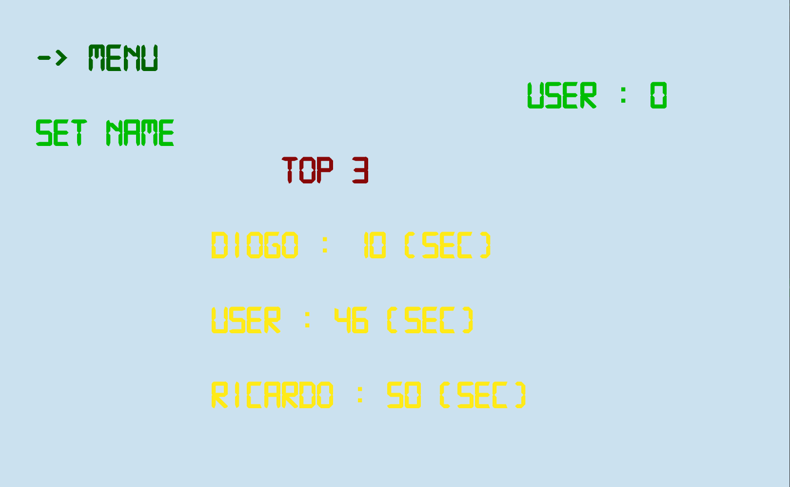
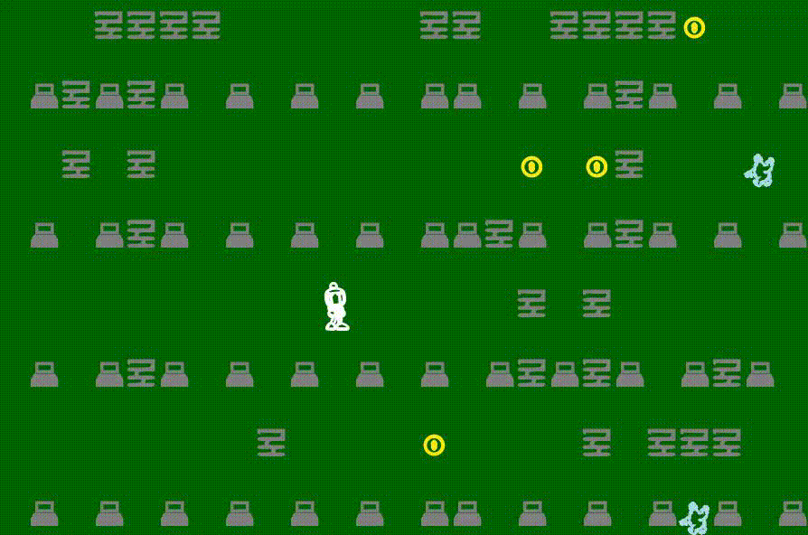
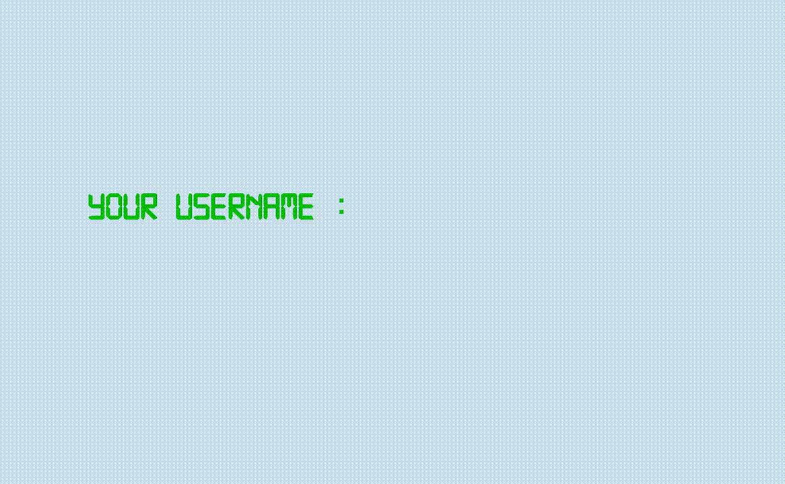

## LDTS<13><03> - BOMBERMAN
Our game consists in a Hero, known as, Bomberman who has the ability to drop BOMBS which are able to destroy some types of blocks and also to KILL the enemies. The Bomberman can collect Coins scattered around the map and use it to buy Power-Ups at the shop. At the Start of the Game your Balance is 10 Coins.  By destroying the blocks you will be able to create a path leading to the door (EXIT) and then win the game. You can also win the game by killing every robot, be CAREFUL!

>This game was developed by *Diogo Babo* (up202004950@fe.up.pt), *João Oliveira* (up202004407@fe.up.pt) and *Ricardo Cavalheiro* (up202005103@fe.up.pt) for LDTS 2021/2022.

## For a more detailed version of this description click [here](./docs/README.md)

## How to Play

You can move the character using
- `🔼` to go up
- `▶️` to go right
- `◀️` to go left
- `🔽️󠀠󠀠󠀠` to go down󠀠

Or you can use `Spacebar` to drop bombs that take 4 seconds to explode.

The main objective is to reach the Exit or destroy all Robots.

## Implemented Features
- [x] Starting Menu
- [x] Pause Menu
- [x] Game Over Menu
- [x] Menu To Get Player Name
- [x] Dificulty Options (Easy or Hard)
- [x] Shop
- [x] Background, Menu and Pause Music
- [x] Sound Effects For Every Interaction
- [x] Bomberman Movement
- [x] Robots
- [x] 2 Strategies of Robot Movement (Random or Agressive)
- [x] Destructible and Indestructible Blocks
- [x] Coins
- [x] Bomb and Explosion Particles
- [x] Power-ups (Change Skin, Increase Speed, Slow Time)
- [x] Exit Door

## Screenshots
  
The following mock-ups will illustrate how the game looks!
### Game preview

  

  <b><i>Fig 1. Bomberman Game</i></b>

 
 

### Menus

  

  <b><i>Fig 2. Main Menu </i></b>

  

 
 

  

  <b><i>Fig 2. Pause Menu </i></b>  

  

 
 

### End Game

  

  <b><i>Fig 3. Win Menu </i></b>  

  

 
 

  

  <b><i>Fig 4. Lose Menu </i></b>  

  

 
 

  

  <b><i>Fig 5. Shop </i></b>  

  

 
 

  

  <b><i>Fig 6. Leaderboard </i></b>  

  

 
 

### Animations

  

  <b><i>Gif 1. Bomb Explosion </i></b>  

  

 
 

  

  <b><i>Gif 2. Set Player Name </i></b>  

  

 
 

