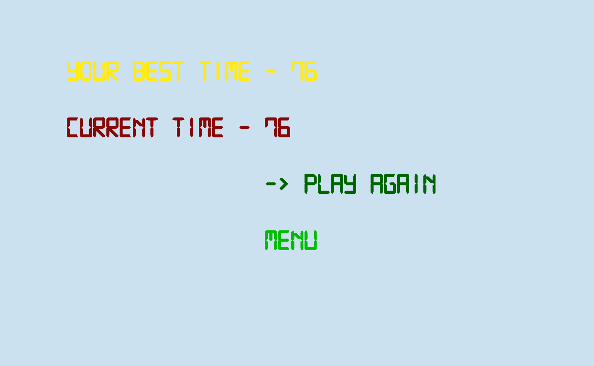
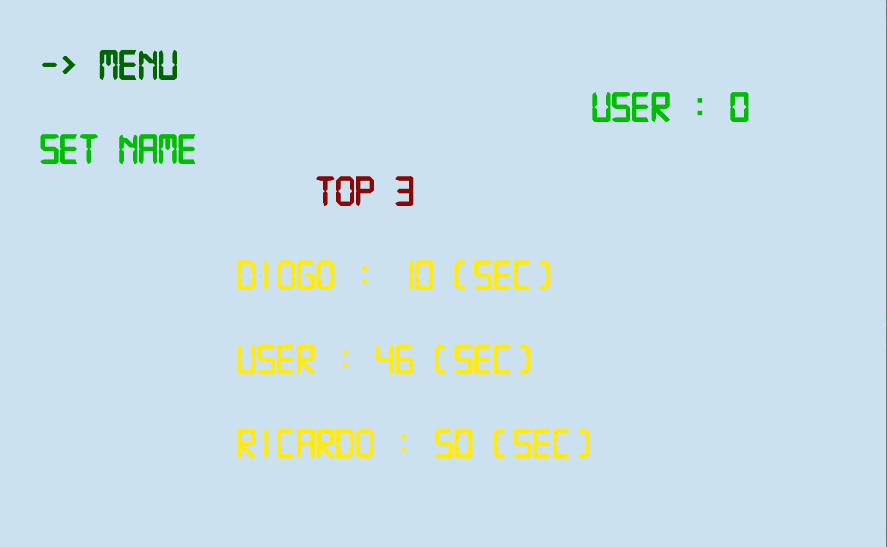
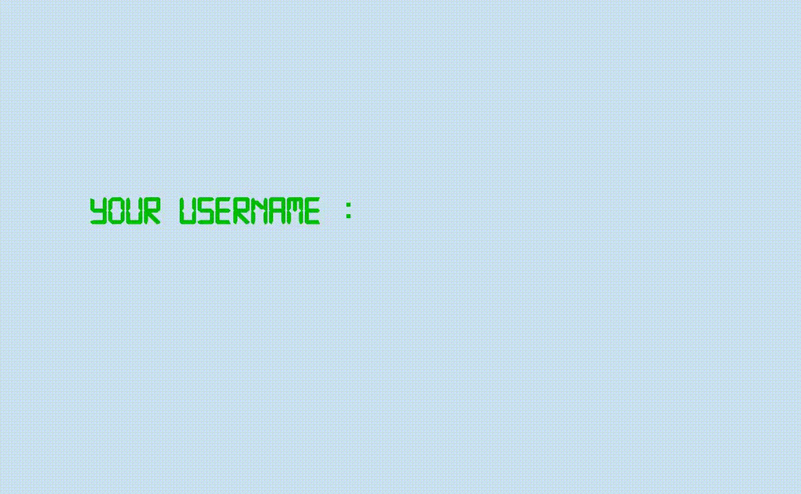
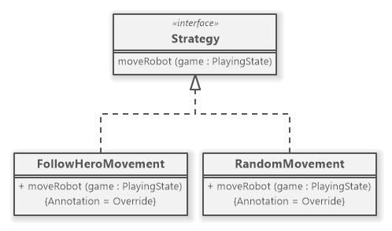
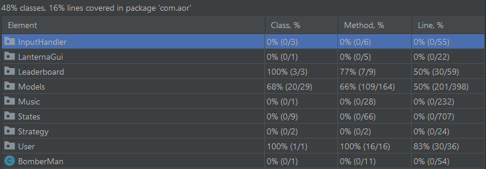

## LDTS<13><03> - BOMBERMAN

Our game consists in a Hero, known as, *Bomberman* who has the ability to drop *BOMBS* which are able to destroy some types of blocks and also to KILL the enemies. The Bomberman can collect *Coins* scattered around the map and use it to buy Power-Ups at the shop. At the Start of the Game your Balance is 10 Coins. By destroying the blocks you will be able to create a path leading to the door (EXIT) and then win the game. You can also win the game by killing every robot, be CAREFUL (*they are fast*)!

>This game was developed by *Diogo Babo* (up202004950@fe.up.pt), *João Oliveira* (up202004407@fe.up.pt) and *Ricardo Cavalheiro* (up202005103@fe.up.pt) for LDTS 2021/2022.

## Table of contents
1. [How to Play](#how-to-play)
2. [Implemented Features](#implemented-features)
3. [Game Preview](#game-preview)
4. [Design Patterns](#design)
5. [Code Smells](#known-code-smells-and-refactoring-suggestions)
6. [Testing](#testing)

## How to Play

You can move the character using
- `🔼` to go up
- `▶️` to go right
- `◀️` to go left
- `🔽️󠀠󠀠󠀠` to go down󠀠

Or you can use `Spacebar` to drop bombs that take 4 seconds to explode.

The main objective is to reach the Exit or destroy all Robots.

### IMPLEMENTED FEATURES

- **Main Menu** - Menu where you can Play the Game, go to the Shop, go to the Leaderboard, select the Difficulty or Exit the Game.
- **Pause Menu** - Pause Menu of the game where you can Resume the Game, go to the Shop or return to the Main Menu.
- **Game Over Menu** - Menu that depends on if you Win or Lose the Game where you can Play Again or return to the Main Menu.
- **Menu To Get Player Name** - Menu where the user types the `PLAYER` name.
- **Difficulty Options** - The Game has two Difficulties (Hard or Easy) that alters robots movement.
- **Shop** - Shop of the Game where you can Buy Power-Ups such as: Change Skin; Increase Speed; Slow Time; (Each One costs 5 Coins) 
- **Background, Menu and Pause Music** - The Game and both Pause and Main Menus have specific Musics.
- **Sound Effects** - Added a special sound effect for every interaction: Scrolling through Menu; Selecting an option; Choosing difficulty; Buying a Power-up or not having enough balance; Winning; Losing; Walking; Dropping and Exploding a Bomb; 
- **Bomberman Movement** - The game character (hero) will move depending on which arrow key is pressed (Up, Down, Left or Right).
- **Robots** - The map has Robots that move around the Map.
- **Robots Strategies** - Robots have two types of Strategies: RandomMovement - Robots move randomly; FollowHeroMovement - Robots chase the Bomberman;
- **Destructible and Indestructible Blocks** - There are two types of blocks, ones which can be destroyed by Bombs and the other that is indestructible;
- **Coins** - There are Coins scattered around the map that the Bomberman can get by walking to them.
- **Bomb and Explosion Particles** - The game character (hero) will drop a bomb where is he currently standing when the space bar is pressed. This bomb is able to destroy the non-concrete blocks but not the others. It is also capable of killing the robots. (The bomb has a time of 4s to explode, and a range of 4 blocks, be careful, don't too close to it!). Also added particles for the explosion to show the range of the Bomb.
- **Power-ups** - The Game has three Power-Ups that the Bomberman can buy at the shop, each one lasts 10 seconds: Change Skin - Hero changes the skin; Increase Speed - Hero moves faster; Slow Time - Robots move slower;
- **Exit Door** - There is A Door in the map where you can go to Win the Game.

### Game Preview

### DESIGN

#### Methods to Draw each class

- **Problem in Context :** One problem we knew from the start we had to deal with was the different methods we had to create to draw each class of the game(Ex: Hero, Robot, Blocks, Bomb).

- **Factory Method :** So we have applied the **Factory Method** pattern. **Element** is an abstract class that has an abstract **draw** method which is overridden by the Hero and Robot classes; that way when you are drawing the board it knows how to draw each class. We also did the same thing for the Concrete Blocks, Destructible Blocks and Bomb.

- **Implementation :** Element is an abstract class which is responsible for creating the moving elements of the board but only the subclasses know how to draw themselves.

These classes can be found in the following files:

- [Element](../src/main/java/com/aor/Models/Element/Element.java)
- [Hero](../src/main/java/com/aor/Models/Element/Hero.java)
- [Robot](../src/main/java/com/aor/Models/Element/Robot.java)

- **Consequences :**

The use of the Factory Method Pattern allows some benefits to the design:

- Removes the need to bind application-specific classes into your code. 
- You can construct objects step-by-step, defer construction steps or run steps recursively. 
- You can introduce new types of Elements into the program without changing existing code.

#### Diferents Strategies of a Robot

- **Problem in Context :** We wanted the Robots to have different ways of deciding where they wanna move in each step to make it harder for the user to win. 

- **Strategy Method :** We used the **Strategy Pattern** to have different ways to move the Robot. 

- **Implementation :** We created two classes that implement the *Strategy* interface: **FollowHeroMovement** which is a strategy where the robots chase the hero; **RandomMovement** which is the other strategy where the robots move randomly across the map.

These classes can be found in the following files:

- [Strategy](../src/main/java/com/aor/Strategy/Strategy.java)
- [FollowHeroMovement](../src/main/java/com/aor/Strategy/FollowHeroMovement.java)
- [RandomMovement](../src/main/java/com/aor/Strategy/RandomMovement.java)

**Consequences**

The advantages of using the Strategy Pattern are the following:

- You can switch algorithms used inside an object at runtime.
- Clean code because you avoid conditional-infested code.
- Open/Closed Principle. You can add new strategies to the Robot without having to change the context.
  
#### Game State

- **Problem in Context :** We needed to alternate between various game states, such as: Playing State, Menu State, Pause State, Shop State, Leaderboard State etc. Initially we thought about having it all on the same class, but soon we realized that was not ideal.

- **State Pattern:** We used the **State Pattern** to allow an object to alter its behavior when his internal state changes.

- **Implementation :** An abstract class **GameState** was created and every state of the game such as Playing State, MenuState, EndGameState and many more, extend this class.

These classes can be found in the following files:

- [GameState](../src/main/java/com/aor/States/GameState.java)
- [DifficultyChangeState](../src/main/java/com/aor/States/DifficultyChangeState.java)
- [EndGame](../src/main/java/com/aor/States/EndGame.java)
- [GetNameState](../src/main/java/com/aor/States/GetNameState.java)
- [LeaderboardState](../src/main/java/com/aor/States/LeaderboardState.java)
- [MenuState](../src/main/java/com/aor/States/MenuState.java)
- [PauseState](../src/main/java/com/aor/States/PauseState.java)
- [PlayingState](../src/main/java/com/aor/States/PlayingState.java)
- [ShopState](../src/main/java/com/aor/States/ShopState.java)

**Consequences**

The advantages of using the State Pattern are the following:

- Organize the code related to particular states into separate classes.
- Introduce new states without changing existing state classes or the context.
- Simplify the code of the context by eliminating bulky state machine conditionals.

#### Observer

- **Problem in Context :** When a power-up is bought by the user we had to notify the game so that it changes in the PlayingState and also after 10 seconds of that power-up we needed to notify it ended.

- **Observer Pattern:** For that we used the **Observer Pattern** which is a behavioral design pattern that lets you define a subscription mechanism to notify multiple objects about any events that happen to the object they’re observing. That way when the user gets for example the *Slow Time* power-up it notifies the robots to move slower.

- **Implementation :** We have a User class which receives a notification that a Playing State is active and notifys it that a power-up has started or ended. Depending on the power-up it changes the skin, speeds up the Hero or slows the Robots.

These classes can be found in the following files:

- [User](../src/main/java/com/aor/User/User.java)
- [Playing State](../src/main/java/com/aor/States/PlayingState.java)
- [UserObserver](../src/main/java/com/aor/States/Observer/UserObserver.java)

**Consequences**

The advantages of using the State Pattern are the following:

- You can establish relations between objects at runtime.
- This method carefully describes the coupling existing between the objects and the observer.
- With the Open/Closed Principle's help, we can introduce the new subscriber class without making a change in the publisher's code.

### Abstract

- **Problem in Context :** From the start we believed that it was important to have multiple objects that although different, may be part of a class that aggregates them. In order to keep the code in check and forfeit the need to have different variables or arrays for different types of elements we came to this solution.

- **Abstract Method :** So we have applied the **Abstract Method** pattern. **GameBlock** is an interface class that has a set of methods which are overridden by the different types of blocks present in the game. Such as **Bomb**,**ConcreteBlock**,etc... This way we can treat two different objects as the same type although their methods' definition is different.

- **Implementation :** GameBlock is an interface class which is responsible for aggregating objects that are fixed in the same position throughout the game.

**Consequences**

The advantages of using the State Pattern are the following:

- You can create new types of objects without changing any current code.
- This method makes it easy to manipulate the standard code and extend it to our own benefit.
- Solves the problem of creating entire product families without specifying their concrete classes.

#### KNOWN CODE SMELLS AND REFACTORING SUGGESTIONS

#### **DATA CLASS**

The `Position` class is a **Data Class**, because it contains fields and not a lot of behavior. However, it is not a bad code smell as it a consequence of the design we choose. It allows you to understand and organize the code and the operations are now gathered in a single place, instead of throughout the code.

#### **SWITCH STATEMENTS**

We had the need to use several if's depending on the direction the hero chooses to go. The refactoring suggestion is to use polymorphism, but we don't find it wise in this case as the code gets far less readable.

#### **LARGE CLASS**

The `PlayingState` class contains many fields and long methods. We find it reasonable as it is the main class of the program and most of the methods don't really make sense to split into other classes.

### TESTING

### Screenshot of coverage report

### Screenshot of pit teste report

### Link to mutation testing report
[Mutation tests](../Pitest/index.html)

### TESTING COMMENTARIES

**Better Code Hub**:

-Automate Tests -> doesn't support groovy tests, so we didn't pass it.

-Write Simple Units Of Code -> The way we developed it is nearly impossible to avoid writing a bunch of IF's & Else's, and we have a lot of these, for example, in the movement of the game characters, verifying if a certain position on the map is free. Other example is the menu, to check the keys pressed by the user, and it's movement we need to check the various conditions.

-Write Code Once -> As we used lots of abstract classes, and interfaces some code is duplicated because we have the same methods but with small differences from class to class. 

**Groovy Tests**:

-Input handler package is responsible for observing the keyboard and notify that class that is using its classes of an input, therefore there is no way to test it

-LanternaGUI package is responsible only for constructing and returning a terminal. Therefore, there isn't the need to test as it doesn't depend on other objects.

-The strategy package is only responsible for giving one of two ways, "strategies", for the robots to move. They either follow the Bomberman or move randomly, this is allowed by the design pattern. So, given that it's not "essential" to test it, we didn't feel the need to do it (as one of the strategies is random) and it's also hard to do so. 

-States package has several trivial classes which are either abstract or interface, or were refactored. Although we should have tested this package we also recognize that majority of this package is contituted by **playingState** and this means most of the code present here is either private or hard to test it since it doesn't work alone. Therefore we weren't able to test.

-The Music package has classes which are audio related, so it was quite hard to test it and we didn't feel the need to do it. Also we based this class on the example it was given to us.

### SELF-EVALUATION

> In this section describe how the work regarding the project was divided between the students. In the event that members of the group do not agree on a work distribution, the group should send an email to the teacher explaining the disagreement.

- Diogo Babo: 32%
- João Oliveira: 32%
- Ricardo Cavalheiro: 32%
- Bruno Lima: 4%
